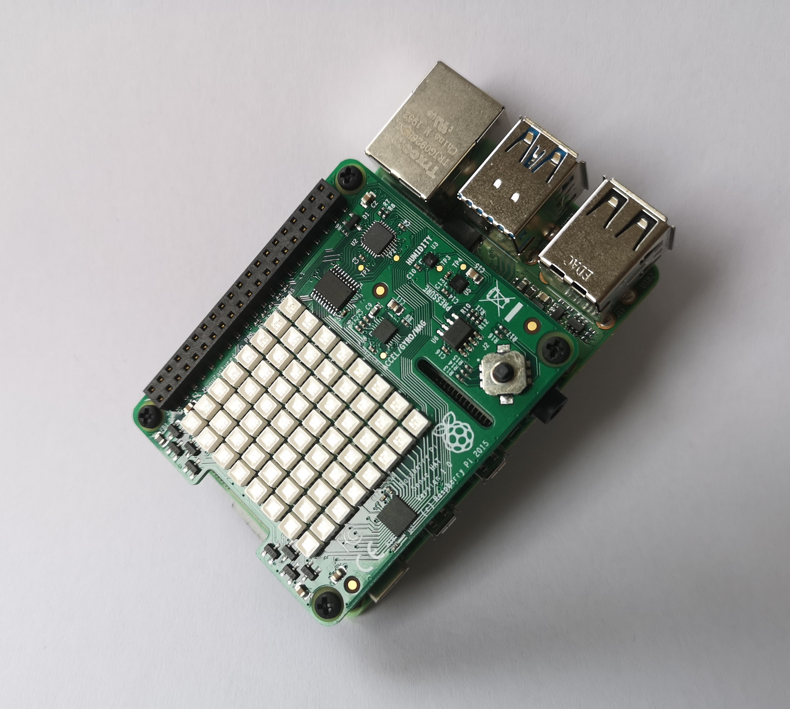
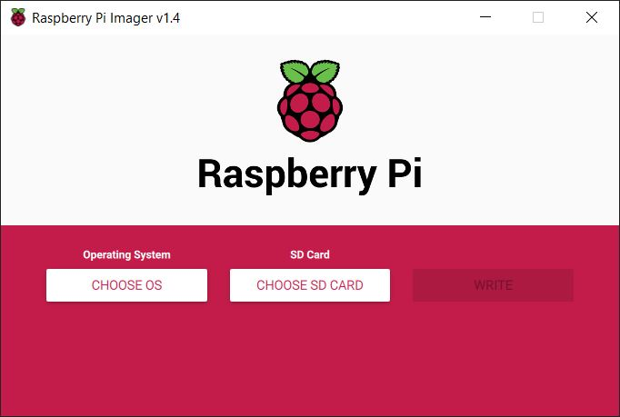
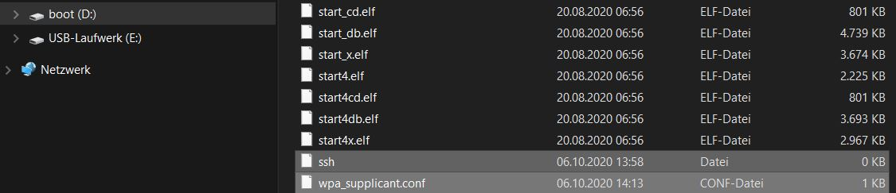
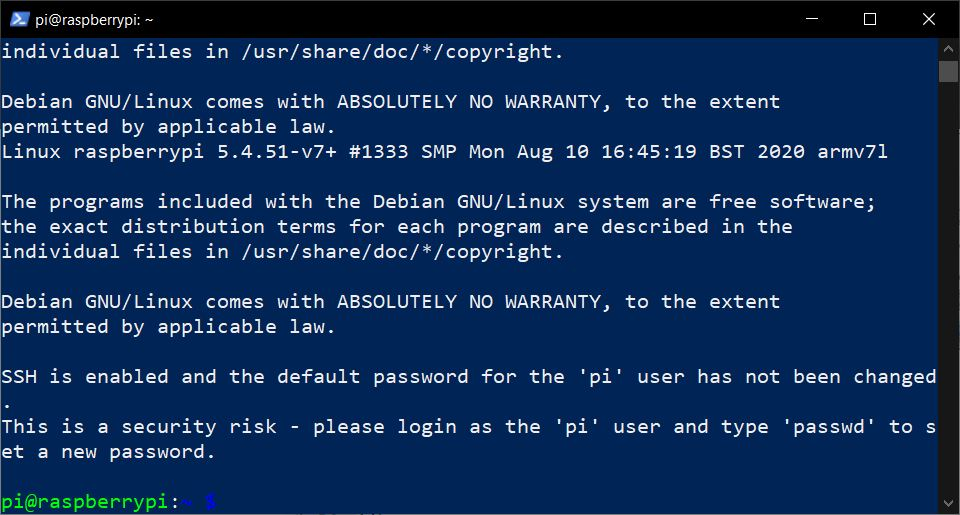

# graphicx.io IoT Device Example

# Connecting a Raspberry Pi with Sense HAT to graphicx.io

This is an IoT Device example using python 3.4 or later, [Sense HAT](https://www.raspberrypi.org/products/sense-hat/) and a [Raspberry Pi](https://www.raspberrypi.org/products/).

The Sense HAT will deliver real temperature and humidity datapoints.

## Quickstart Guide

If you are not yet familiar with the [Quickstart Guide of graphicx.io](https://helpcenter.graphicx.io/en/support/solutions/79000057338) please make sure to read it first. This will amongst other things give you an understanding of the graphicx.io MQTT API for Data Collection which is used in this example. The format used in this example is the [Default Payload Format for starting quickly](https://helpcenter.graphicx.io/en/support/solutions/articles/79000120235-data-collection-via-mqtt) described in that article.    

## Prerequisites

Following prerequisites must be fulfilled:

- Sign up for a trial version of graphicx.io - you  will need the login credentials sent by e-mail during the sign up process
- Raspberry Pi with Raspberry Pi OS and connected to the internet

That´s it!

# Setup Raspberry Pi with Sense HAT and python 3.4 or later



## Booting Raspberry Pi 4 with Sense HAT successfully

The Raspberry Pi 4 may not boot up when the Sense HAT is mounted. You need to make following changes to avoid this situation: 

In the boot path of the sd-card you need to adjust the `config.txt` file.
It is typically located at `/boot/config.txt` and is usually writeable.
Note the official tool `raspi-config` also alters this file and via this tool the file might even have been set to read-only. You can use the tool to make it writeable again.

In the file look for:

```
# hdmi_force_hotplug=1
```

The only thing you have to do is uncomment this line to:

```
hdmi_force_hotplug=1
```

Now you can mount the Sense HAT and the Raspberry Pi OS should boot.

Why is that? Let us cite an official article. "If you are working headless then please note that per default the RPI4 no longer creates a video output display, as a RPI4 no longer switches to Composite when it doesn't detect a HDMI device, so a /dev/fbN frame buffer node is not created." However, the Sense HAT needs such a frame buffer to work. Forcing the HDMI hotplug option makes the Raspberry Pi 4 create such a frame buffer anyways so that it is ready should an HDMI cable get plugged in hot. In this case we benefit from this behavior for integrating the Sense HAT successfully.

## Sense HAT and the temperature measurements

When using an Raspberry Pi 4 in combination with a Sense HAT mounted on top, the temperature values will be influenced from the temperature of the more powerful CPU of the PI 4. People consider subtracting some static or dynamic offset.

## Set up a Raspberry Pi in headless mode

For this example we set up the Raspberry Pi in headless mode (this means you don´t connect a monitor, keyboard and mouse).

You can alternatively setup the Raspberry Pi in a different way of your choice. For example, you might choose to use your Raspberry Pi with monitor, keyboard and mouse, the example will of couse also work, just you would need to skip all or certain steps in this chapter.
There are numerous guides including the ones at the [official Raspberry Pi site](https://projects.raspberrypi.org/en/projects/raspberry-pi-setting-up).

1. Download and install [Raspberry Pi Imager](https://www.raspberrypi.org/downloads/) for your  system (Windows, Linux, Mac)

2. Install Raspberry Pi OS (32-bit) Lite using the Raspberry Pi Imager:


    - "CHOOSE OS" =>> Raspberry Pi OS (other) =>> Raspberry Pi OS (32-bit) Lite

    - "CHOOSE SD CARD" click on it and choose the mini sd-card (connected to your PC) which you intend to use for the Raspberry Pi

    - Press "WRITE"

3. After the write and verify process has finished remove the mini sd-card from the reader or USB port (this is important for the next step)

4. Insert the sd-card again in the reader or USB port. A volume named `boot` will appear in your file explorer. Please copy 
 `ssh` and `wpa_supplicant.conf` from `.\graphicx-io-raspi-sense-hat-python\raspberry_pi_headlessin` the `root` directory. The following picture illustrates this step under Windows 10:
 

5. Open `wpa_supplicant.conf` and adjust the credentials (SSID and password) for the Wifi you are using:

    ```
    country=DE
    ctrl_interface=DIR=/var/run/wpa_supplicant GROUP=netdev
    update_config=1

    network={
        ssid="NETWORK-NAME"
        psk="NETWORK-PASSWORD"
    }
    ```

6. Place the sd-card in the Raspberry Pi and plug the Sense HAT extension on top. If you are using a Raspberry Pi4 you need to adjust the `config.txt` BEFORE the first boot up - more information at the end of this document.

7. Connect the Raspberry Pi to a power source. 

## Connect via SSH

For Linux und Mac, SSH functionality is also build in the CLIs.

In Windows 10 use PowerShell to connect to your Raspberry Pi.

Use following command to access your Raspberry Pi:

```
ssh pi@raspberrypi
```

In some cases depending on your networking, you might need to know the IP address of the Raspberry Pi and use it instead of the hostname `raspberrypi`. Of course, it could also be that you assigned a different hostname to your device. 

The default user is `pi`and the default password is `raspberry` (you should change the password after your first login - instruction are given after the first login).

The following picture shows an example of a screen after login via SSH, in this case under Windows 10: 


## Hints to optimize a Raspberry Pi 4 for 24/7 operation

In the Internet you can find various hints to optimize a Raspberry Pi 4 for 24/7 operation. Here, we give you some hints. Regarding how to achieve each of these, please search for articles on the Internet.

- To reduce disk wear disable swapping in the OS.
- To reduce disk wear map /var/log and similar locations to a temporary file system (tmpfs) or a RAM-disk file system (ramfs).
- To reduce disk wear configure the system.d service journal to be volatile which in this case means in-memory. 
- Activate the watchdog.

## Setup python Environment

To use the example you need to install following packages:

- [Git](https://git-scm.com/)
- [Sense HAT packges](https://www.raspberrypi.org/documentation/hardware/sense-hat/)
- [python-pip](https://pypi.org/project/pip/)
- [paho-mqtt](https://pypi.org/project/paho-mqtt/)

For this documentation we will use pictures showing a Raspberry Pi headless configuration using SSH command line using PowerShell.

Before starting, it is good practise to update to the latest versions for the installation process by entering:

```
sudo apt-get update && sudo apt-get upgrade
```

As a next step all necessary packages and files will get installed by entering:

1. ```
    sudo apt install git
    ```
    
    To be able to clone the repository with the example .

2. ```
    sudo apt-get install sense-hat
    ```
    
    Adding necessary python packages for the Sense HAT extension of the Raspberry Pi

3. ```
    sudo apt install python3-pip
    ```
    
    Installs Pip for python.

4. ```
    git clone https://github.com/recogizer-analytics/graphicx-io-raspi-sense-hat-python.git
    ```
    
    Since we have installed [Git](https://git-scm.com/downloads) on our Raspberry Pi we simply can clone the repository.

5. ```
    cd graphicx-io-raspi-sense-hat-python
    ```
    
    Changes the directory to the cloned repository.

6. ```
    pip3 install -r requirements.txt
    ```
    
    This will install paho-mqtt packages for python.

# Run the example on the Raspberry Pi with Sense HAT

## Configure the software

To adjust all necessary parameters in the configuration file simply use following command in the CLI of the Raspberry Pi:

```
python3 config.py
```

If python 3.4 or higher happens to be the default, this could also be just:

```
python config.py
```

The little script (config.py) will ask you for following parameters and adjusts the configuration file:

- MQTT Topic Prefix
- Device Identifier
- MQTT Broker Host
- MQTT Broker Port
- MQTT username
- MQTT password
- MQTT Client ID
- Use Led-Matrix

If you are not yet familiar with these parameters please read the [Quickstart Guide of graphicx.io](https://helpcenter.graphicx.io/en/support/solutions/79000057338).

The MQTT Client ID is usually a unique ID per IoT Device in case there is only one MQTT Client on the Device.

If use_led_matrix is the string 'true' or 'True' the program will draw an elegant X on the LED-Matrix. The color of the X depends on the current status. It is neutral during start of the program including initially connecting to the MQTT Broker. It is a highlight color during taking and sending measurements. It is yellow on exit due to an interrupt. It is red when there is a failure.

Note: If the configuration file does not yet exist, it will be created. If it already exists, each current value will be presented and you will be asked if you want to keep or change it. 

## Start to send MQTT messages with measurement data

Once you reached this step, the only remain task is to start the program and thus send real temperature and humidity data to the graphicx.io portal. Enter the following command in the CLI of the Raspberry Pi:

```
python3 main.py
```

If python 3.4 or higher happens to be the default, this could also be just:

```
python main.py
```

The script will start to connect and send data.

## Run this as a service

This here is based on systemd and it can be compared to running a container in Docker.

We prepared for you the file ./runasservice/senddataviamqtt.service which you may consider adjusting and copying as mentioned in [this official article](https://www.raspberrypi.org/documentation/linux/usage/systemd.md):

`sudo cp senddataviamqtt.service /etc/systemd/system/senddataviamqtt.service`

Once copied, you can attempt to start the service using the following command:

`sudo systemctl start senddataviamqtt.service`

See its status with:

`systemctl status senddataviamqtt.service`

See not only a part, but all of its available output, so to say its logging output that it writes to stdout and strerr:

`journalctl -u senddataviamqtt.service`

Stop it with:

`sudo systemctl stop senddataviamqtt.service`

When this has worked and you are happy, you can have it start automatically on reboot by using this command:

`sudo systemctl enable senddataviamqtt.service`
